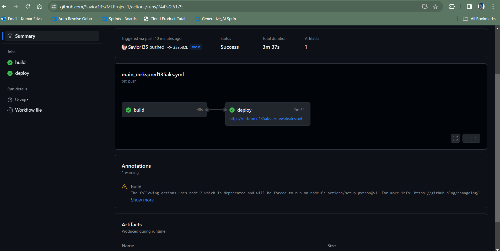
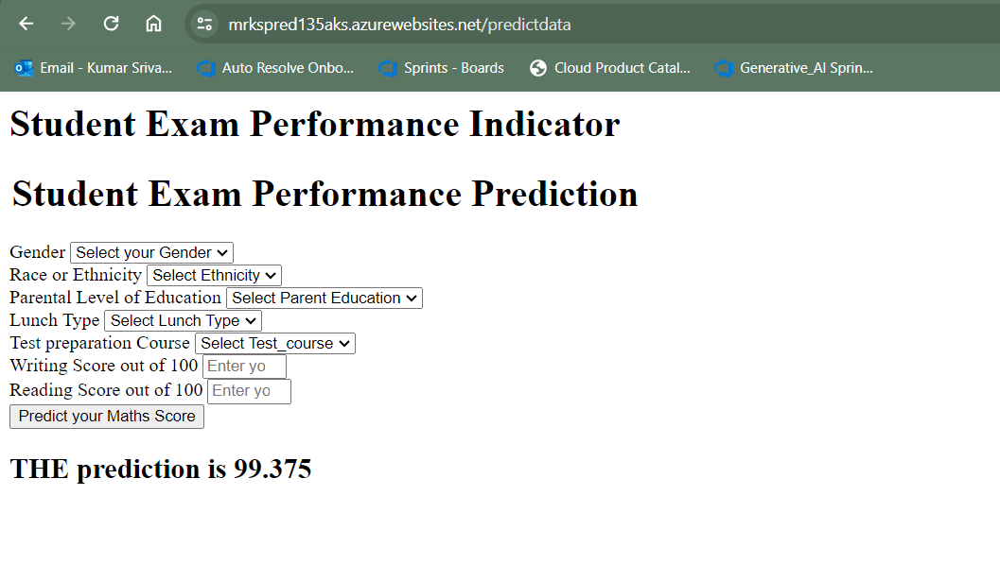

## END TO END DATA SCIENCE PROJECT 
## DEPLOYMENT VIA AZURE WEBAPP USING GITHUB ACTIONS - 

# Problem Statement
- This project understands how the student's performance (test scores) is affected by other variables such as Gender, Ethnicity,Parental level of education, Lunch and Test preparation course.

- Dataset Source - https://www.kaggle.com/datasets/spscientist/students-performance-in-exams?datasetId=74977
- The data consists of 8 column and 1000 rows.

### 2.2 Dataset information
- gender : sex of students  -> (Male/female)
- race_ethnicity : ethnicity of students -> (Group A, B,C, D,E)
- parental level of education : parents' final education ->(bachelor's degree,some college,master's degree,associate's degree,high school)
- lunch : having lunch before test (standard or free/reduced) 
- test preparation course : complete or not complete before test
- math score
- reading score
- writing score

## APPROACH FOR THE PROJECT 

- Extracted data from CSV file 
- performed EDA in jupyter notebook-
    -EDA steps-
    - Check Missing values
    - Check Duplicates
    - Check data type
    - Check the number of unique values of each column
    - Check statistics of data set
    - Check various categories present in the different categorical column
    - Univariate and Bivariate analysis 

- Feature Engineering-
    - One hot encoding
    - Standardization
    - Multicollinearity check

- Model Training -
    - Pipeline creation to train data on multiple models (Linear Reg, DecisionTreeReg, RandomForestReg, KNNreg, XGBoostreg)
    - Hyperparameter Tuning of all the models
    - Evaluation of Model using metrics (MAE, MSE, RMSE, R2score)
    - Selection of Best Model
    - Dumping the model as pickle file using joblib

- Deployment - 
    - Wrapped the code under Flask web application
    - created Landing Page and Data Form Page
    - Deployed the app on Azure WEB APP using Github Action

Azure web app link - https://mrkspred135aks.azurewebsites.net/

Github Action Screenshot - 

Azure Web App UI ScreenShot- 

